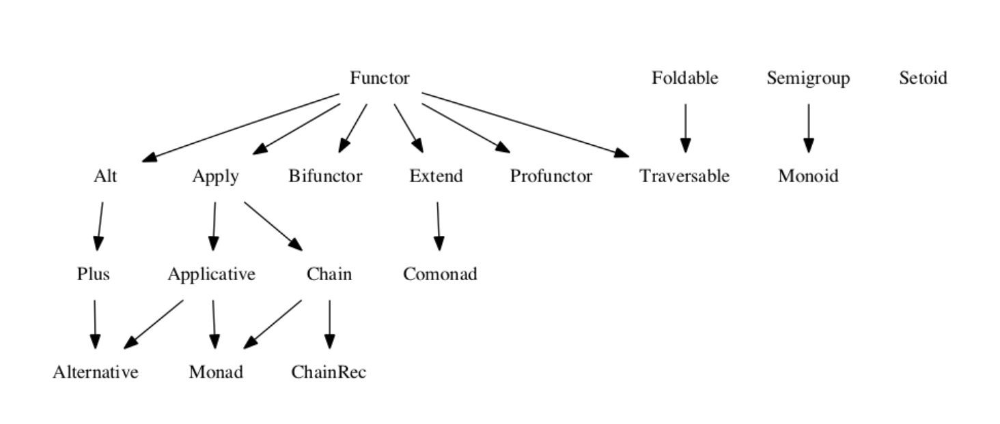

* [참조: medium](https://medium.com/free-code-camp/functional-programming-in-js-with-practical-examples-part-2-429d2e8ccc9e)
* functor : has 'map' method (e.g Array is functor because it has 'map' function)
* applicative : has 'map', 'ap', 'of' method
* monad : has 'map', 'ap', 'of', 'chain' method

